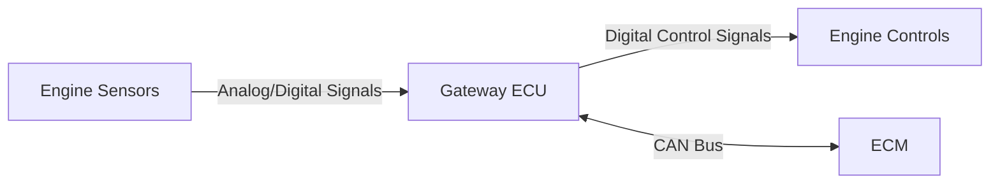
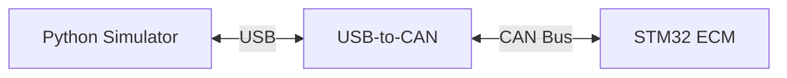

# Hardware-in-the-Loop Engine Simulator
This project uses Python and a USB-to-CAN module to simulate and transmit typical engine sensor data. On the other end is an STM32 acting as the Engine Control Module (ECM) written in C, which will relay back messages to maintain engine stability given a variable throttle input. This configuration mirrors modern vehicle configurations, where analog and digital sensor data is passed into a Gateway Engine Control Unit (ECU) before being sent to the ECM over CAN bus.

> IN EARLY DEVELOPMENT - there are no guarantees anything works yet.

## Real-World Architecture

## Simulator Architecture

## Documentation
- [Simulator](simulator/README.md)
- [ECM](ecm/README.md)
- [CAN Specification](docs/can_spec.md)
