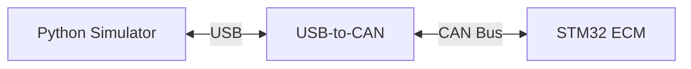

# Hardware-in-the-Loop Engine Simulator
This project uses a USB-to-CAN module to simulate and transmit typical engine sensor data using Python. On the other end is an STM32 acting as the Engine Control Module (ECM) written in C, which will relay back messages to maintain engine stability given a variable throttle input. 

> IN EARLY DEVELOPMENT - there are no guarantees anything works yet.

## Architecture

## Documentation
- [Simulator](simulator/README.md)
- [ECM](ecm/README.md)
- [CAN Specification](docs/can_spec.md)
